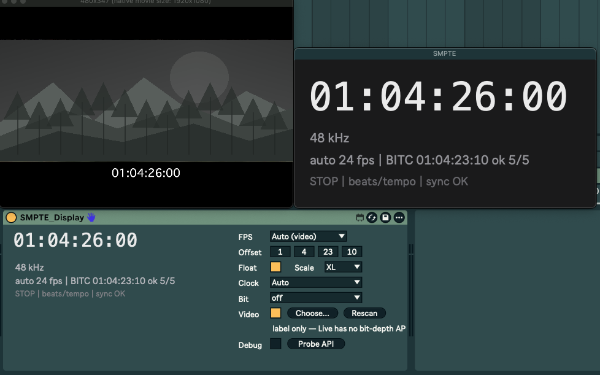

<div align="center">

# SMPTE Display for Ableton Live

**A Max for Live device that shows SMPTE timecode in a floating window over the Arrangement View — type a timecode to jump straight there.**

[](https://github.com/emile-lab/M4L-SMPTE-Display-For-Ableton-Live/releases/latest)
[](https://www.ableton.com/live/max-for-live/)
[](#requirements)
[](LICENSE)

[한국어](README.md) · **English**



### [⬇️ Download Beta 0.2](https://github.com/emile-lab/M4L-SMPTE-Display-For-Ableton-Live/releases/latest)

</div>

> [!NOTE]
> **This is a beta.** Bug reports and feedback are welcome in [Issues](https://github.com/emile-lab/M4L-SMPTE-Display-For-Ableton-Live/issues/new/choose).

---

## Features

| Feature | Description |
|---|---|
| 🕒 **Floating timecode window** | Shows the current position as `HH:MM:SS:FF` in a small window above Live. Sizes S / M / L / XL. |
| ⌨️ **Locate by timecode** | Click the window, type `01:23:45:12`, press **Enter** to jump. **Space** jumps and starts playback. |
| 🎬 **Video FPS detection** | Uses the frame rate of the video clip (MOV / MP4 / M4V) in your Arrangement. |
| 🔎 **Burned-in timecode (BITC) reading** | Reads the timecode printed in the video picture, sets the Offset for you, and shows `sync OK` while playing. *(macOS)* |
| 🎯 **Frame accurate** | After stopping or clicking, Live's video window and the SMPTE display point at the same frame. |
| 📈 **Tempo automation aware** | Displays and locates by real elapsed time, even across tempo ramps. |

Frame rates: 23.976 · 24 · 25 · 29.97 (NDF / DF) · 30 · 50 · 59.94 (NDF / DF) · 60

## Requirements

| Item | Details |
|---|---|
| Ableton Live | **Live 12 Suite**, or **Standard + Max for Live** (tested on 12.4.5) |
| OS | **macOS 11+** (Apple Silicon / Intel). Burned-in timecode reading is macOS only. |
| Windows | Not tested. Burned-in timecode reading is not available. |
| Extra installs | None |

## Install (3 steps)

**1. Download and unzip.**
Get `SMPTE_Display_Beta_0.2.zip` from [Releases](https://github.com/emile-lab/M4L-SMPTE-Display-For-Ableton-Live/releases/latest) and unzip it.

**2. Remove the macOS quarantine flag.** *(needed for burned-in timecode reading)*
macOS quarantines downloaded files, which stops the timecode reader (`bitc_reader`) from running. Open **Terminal** and run the command below, adjusting the path to where you unzipped it:

```bash
xattr -dr com.apple.quarantine ~/Downloads/SMPTE_Display_Beta_0.2
```

**3. Copy to your User Library and add it to a track.**
1. Copy the whole `SMPTE_Display` **folder** to
   `User Library/Presets/Audio Effects/Max Audio Effect/`
   *(find your User Library location in Live under **Settings → Library**).*
2. In Live's browser, drag `SMPTE_Display.amxd` from **User Library** onto a track — the **Main track** is recommended. Audio passes through unchanged.

> [!IMPORTANT]
> `SMPTE_Display.amxd`, the four `.js` files and `bitc_reader` **must stay in the same folder**. Moving the `.amxd` on its own will not work.

> [!TIP]
> **Updating from the DEMO version:** replace the old `SMPTE_Display` folder, then **delete the device from your Set and drag it in again**. Instances already in a Set may keep running the old version.

## Quick start

1. Switch to the **Arrangement View** — the timecode window appears in the middle of the screen.
2. Pick an **FPS** on the device. `Auto (video)` (default) follows the video clip, or uses 24 fps if there is no video.
3. Press play — the timecode runs in real time.
4. **Click** the timecode → type → **Enter** to locate.

### Input examples

| Typed | Goes to |
|---|---|
| `01:23:45:12` | 01:23:45:12 |
| `01:23:45;12` | 01:23:45:12 (drop-frame notation) |
| `1:30:00` | 00:01:30:00 (filled from the right) |
| `01101010` | 01:10:10:10 (digits only) |

### Keys

| Key | Action |
|---|---|
| **Enter** | Locate. Invalid input turns red and nothing moves. |
| **Space** (while typing) | Locate, then play. |
| **Space** (not typing) | Play / stop |
| **Esc** | Cancel input (also cancels after 10 s without typing). |

### Device controls

| Control | Description |
|---|---|
| **FPS** | Timecode frame rate. `Auto (video)` follows the video clip. |
| **Offset** | Timecode at timeline zero (e.g. `01:00:00:00`). Set automatically when burned-in timecode is found. |
| **Float** / **Scale** | Floating window on/off / size (S · M · L · XL) |
| **Clock** | How time is computed. Leave on `Auto` in most cases. |
| **Bit** | Bit-depth label for display only — Live does not expose the real value. |
| **Choose…** / **Rescan** | Pick a video file yourself / search the Arrangement for video again. |

## Burned-in timecode (BITC) — macOS

If the video picture has a timecode burned in, the device reads five frames and **sets the Offset automatically.**

| Info line | Meaning |
|---|---|
| `BITC 00:59:56:00 ok 5/5` | Read successfully; Offset applied. |
| `BITC mismatch 3/5` | Readings disagree; nothing applied. |
| `BITC rate != 24 fps` | Video and selected FPS differ; nothing applied. |
| `sync OK` / `sync +2 fr` | Sync status during playback (checked about every 5 s). |
| `clip off frame grid` | The video clip sits between frame boundaries. Turn on snap and align it to the grid. |

## Good to know

- **SMPTE here is elapsed time, not bars and beats.** Changing the tempo changes the timecode at a given bar — which is what you want for picture sync.
- The floating window shows **only in the Arrangement View** and hides in the Session View. It does not move with Live's main window.
- **Locating past the end of the Set** creates a MIDI track called `SMPTE extend` with a short empty clip, because Live cannot move beyond the Set's end. You can undo it or delete it.
- With a video in the Set, the playhead may shift by less than half a frame after you stop or click, so Live's video window and the timecode show the same frame.
- After typing in the floating window it keeps keyboard focus. Click Live's window once to use Live shortcuts again.

## Troubleshooting

<details>
<summary><b>The floating window doesn't appear</b></summary>

- Make sure you are in the Arrangement View (Tab key).
- Check that **Float** is on.
- It may be on another display. Remove and re-add the device — it opens in the middle of the display that holds Live's window.
</details>

<details>
<summary><b>Burned-in timecode isn't detected / <code>BITC error</code></b></summary>

- Make sure you ran the `xattr` command from [step 2](#install-3-steps) — this is the most common cause. Press **Rescan** afterwards.
- Use MOV / MP4 / M4V video.
- Press **Rescan**, or select the file with **Choose…**.
- Warped video clips are not compared. Turn Warp off on the clip.
</details>

<details>
<summary><b>The timecode only shows <code>--:--:--:--</code></b></summary>

- Switch from the Session View to the Arrangement View.
- Make sure the device is switched on.
- Select an FPS manually.
</details>

<details>
<summary><b>I updated, but it still behaves like the old version</b></summary>

Devices already in a Set keep the old version. Delete the device from the track and drag it in again from the browser.
</details>

<details>
<summary><b><code>beyond the end of the Set</code> / <code>could not extend the Set</code></b></summary>

The position is past the end of the Set and the Set could not be extended automatically. Put any clip in the Arrangement after the position you want, then try again.
</details>

Still stuck? Please file a [bug report](https://github.com/emile-lab/M4L-SMPTE-Display-For-Ableton-Live/issues/new?template=bug_report.yml).

## Changelog

See [CHANGELOG.md](CHANGELOG.md).

## License

**Copyright © 2026 Emile (emile-lab). All rights reserved.**

- ✅ Free to use in personal **and commercial** music / picture work.
- ❌ **No redistribution, re-uploading, selling, or distributing modified versions** of the device files.
- 🔗 To recommend it, please share **a link to this repository** instead of the files.

Full terms: [LICENSE](LICENSE).

---

<sub>Ableton, Ableton Live and Max for Live are trademarks of Ableton AG. Max is a trademark of Cycling '74. This project is not affiliated with Ableton or Cycling '74.</sub>
